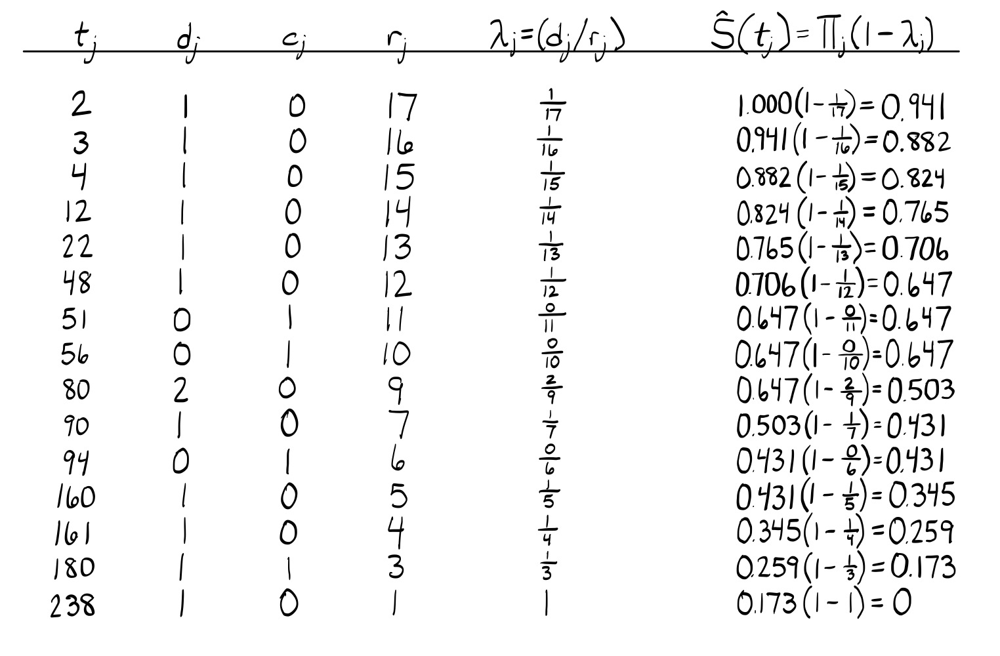

# Question 1

```{r message=FALSE, warning=FALSE}
library(tidyverse)
library(survival)
library(survminer)

# Load in Q1 data
q1_df = read_csv("data/Q1data_extracted.csv")
```

a.  The MLE $\hat\lambda$ for an Exponential distribution is given by:  
    $$
    \hat\lambda = \frac{d}{\sum_i t_i} = \frac{\text{The number of events}}{\text{Person-time: total number of time units observed on all individuals}}
    $$

    Using R to calculate:
    ```{r}
    # Calculate number of events and person-time for relapse
    d_relapse = sum(pull(q1_df, Relapse))
    sum_time_relapse = sum(pull(q1_df, Relapse_Time))
    
    # Calculate relapse MLE
    mle_relapse = d_relapse/sum_time_relapse
    
    # Calculate number of events and person-time for death
    d_death = sum(pull(q1_df, Death))
    sum_time_death = sum(pull(q1_df, Death_Time))
    
    # Calculate death MLE
    mle_death = d_death/sum_time_death
    ```

    `mle_relapse` $\hat\lambda_{relapse}$ = `r round(mle_relapse, 3)`
    
    `mle_death` $\hat\lambda_{death}$ = `r round(mle_death, 3)`
    
    The maximum likelihood estimator $\hat\lambda$ is an estimator for the hazard rate parameter, $\lambda$, which is constant in an exponential distribution. The estimated hazard rate of relapse $\hat\lambda_{relapse}$ is `r round(mle_relapse, 3)` events per month of person-time. The estimated hazard rate of death $\hat\lambda_{death}$ is `r round(mle_death, 3)` events per month of person-time.

b. We can use the MLE to calculate the quantities below.  
    i. **Mean**  
       The expectation, or mean, of the exponential distribution is $\frac{1}{\lambda}$.  
       $$
       \mu_{relapse} = 1/`r round(mle_relapse, 3)` = `r 1/round(mle_relapse, 3)`
       $$
       $$
       \mu_{death} = 1 / `r round(mle_death, 3)` = `r round(1/mle_death, 3)`
       $$
    ii. **Median**  
        The median of an exponential distribution is given by $\tau = \frac{-log(0.5)}{\lambda}$. 
        $$
        \tau_{relapse} = \frac{-log(0.5)}{`r round(mle_relapse, 3)`} = `r round((-1 * log(0.5))/mle_relapse, 3)`
        $$
        $$
        \tau_{death} = \frac{-log(0.5)}{`r round(mle_death, 3)`} = `r round((-1 * log(0.5))/mle_death, 3)`
        $$
    iii. **1 & 2 Year Relapse-Free & Survival Probabilities**  
         These are calculated using the survival functions $S_R(t)$ and $S_D(t)$. Under the exponential distribution $S(t) = e^{-\lambda t}$.
         $$
         S_R(12) = e^{- `r round(mle_relapse, 3)`(12)} = `r round(exp(-mle_relapse * 12), 3)`
         $$
         $$
         S_R(24) = e^{- `r round(mle_relapse, 3)`(24)} = `r round(exp(-mle_relapse * 24), 3)`
         $$
         $$
         S_D(12) = e^{- `r round(mle_death, 3)`(12)} = `r round(exp(-mle_death * 12), 3)`
         $$
         $$
         S_D(24) = e^{- `r round(mle_death, 3)`(24)} = `r round(exp(-mle_death * 24), 3)`
         $$
    iv. **1 & 2 Year Relapse and Death Probabilities**  
        This is easily calculated from the survival function since $F(t) = 1 - S(t)$.
        $$
        F_R(12) = 1 - S_R(12) = `r round(1 - exp(-mle_relapse * 12), 3)`
        $$
        $$
        F_R(24) = 1 - S_R(24) = `r round(1 - exp(-mle_relapse * 24), 3)`
        $$
        $$
        F_D(12) = 1 - S_D(12) = `r round(1 - exp(-mle_death * 12), 3)`
        $$
        $$
        F_D(24) = 1 - S_D(24) = `r round(1 - exp(-mle_death * 24), 3)`
        $$
    v. **Probability of Staying Relapse-Free 2 Years Given 1 Year Relapse-Free**  
       This is a conditional probability denoted as $S_R(24|12)$ and is easily calculated using $S_R(24|12) = S_R(24) / S_R(12)$ since it is certain $S_R(12|24) = 1$. This simplification is shown below.
       $$
       S_R(24|12) = \frac{S_R(24 \cap 12)}{S_R(12)} = \frac{S_R(12|24)S_R(24)}{S_R(12)} = \frac{S_R(24)}{S_R(12)} = \frac{`r round(exp(-mle_relapse * 24), 3)`}{`r round(exp(-mle_relapse * 12), 3)`} = `r round(exp(-mle_relapse * 24) / exp(-mle_relapse * 12), 3)`
       $$
       As expected, $S_R(24|12) = S_R(12)$ since the hazard rate $\lambda$ of an exponential distribution is constant.
    vi. **Median (Using Non-Parametric Methods)**  
        If an exponential distribution is not assumed, the median time-to-event can be calculated using a Kaplan-Meier estimate. However, in this case, only the median time-to-relapse can be calculated. The median time-to-event is given by the smallest $t$ where $\hat{S}(t) \leq 0.5$. For deaths, the KM survival estimator $\hat{S}(t)$ never reaches 0.5, since 7 of 10 observations are censored, and can therefore not be estimated. For relapse, $\hat{S}(t)$ drops to 0.5 at 27 months, so the median time-to-relapse is calculated to be 27 months. This can be confirmed with R:
    ```{r message=FALSE, warning=FALSE}
    km_q1 = survfit(
      Surv(Relapse_Time, Relapse) ~ 1, 
      data = q1_df)
    
    surv_median(km_q1)
    
    ```

# Question 2

```{r message=FALSE}
# Load in Q2 data
q2_df = read_csv("data/Q2data_extracted.csv")
```

a. Kaplan-Meier Survival Estimate

   

b. 
    ```{r}
    # Log-log CI
    km_loglog = survfit(
      Surv(Value, Binary) ~ 1, 
      data = q2_df, 
      conf.type = "log-log")
    
    summary(km_loglog)

    # Linear CI
    km_linear = survfit(
      Surv(Value, Binary) ~ 1, 
      data = q2_df, 
      conf.type = "plain")
    
    summary(km_linear)
    ```

   The "log-log" approach to calculating the 95% confidence intervals is done in order to keep the interval within the [0, 1] bounds of probability. The "linear" approach however is a simple $\hat{S}(t) \pm z_{1-\alpha/2}(SE)$ which can often lead to confidence intervals out of the [0, 1] interval. This does indeed happen with the above Linear CI calculation but the shown interval is truncated at 0.000 and 1.000 by the `survfit()` function. Using the linear CI calculation, the upper 95% CI at $t_j=2$ is:
   $$
   \hat{S}(t) \pm z_{1-\alpha/2}(SE) = 0.941 + 1.96(0.0571) = 1.053
   $$
c. KM Plot

    ```{r message=FALSE, warning=FALSE}
    ggsurvplot(
      km_loglog,
      data = q2_df,
      conf.int = TRUE,
      ggtheme = theme_bw(),
      xlab = "Time (months)",
      ylab = "Survival Probability")
    ```

d. 


        